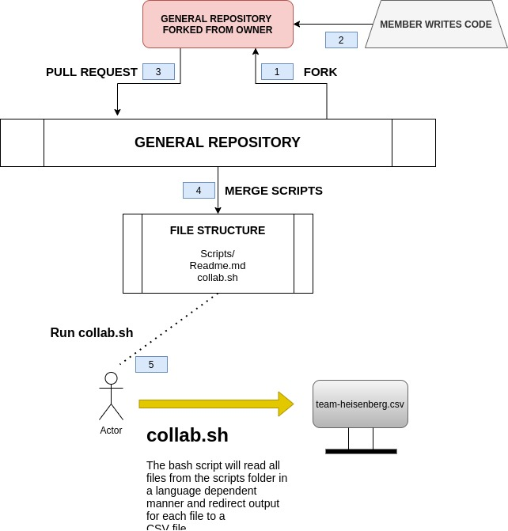

# Team-heisenberg

## THE TASK : Generate a CSV files of details of all the team members using 7 or more programming languages                                                         

## VERSION INFORMATION:

1. g++ (Ubuntu 9.3.0-10ubuntu2) 9.3.0
2. javac 11.0.8
3. Python 3.7.7
4. perl 5, version 30, subversion 0 (v5.30.0)
5. R version 4.0.2

## Workflow:

### Deadline for task: 6th of August, 2020.

